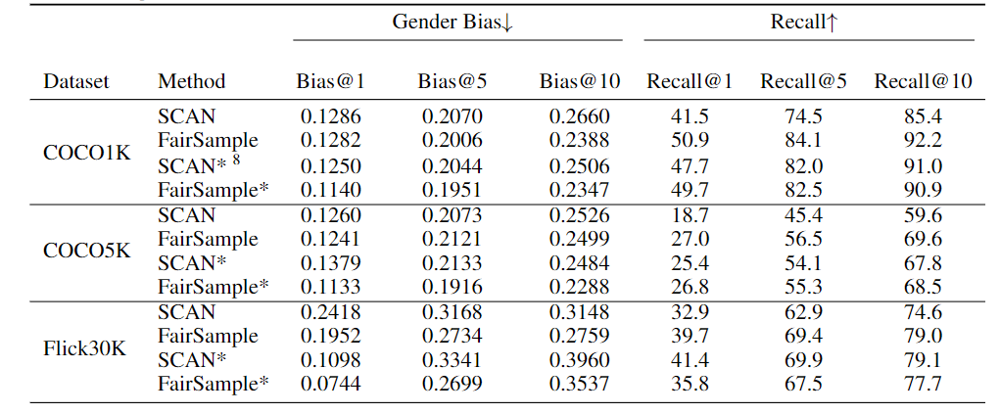
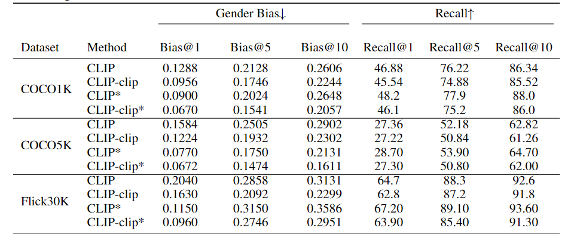

# NLP project for cse517

This is a repo to reproduce the paper https://aclanthology.org/2021.emnlp-main.151.pdf

# Dependency:

See requirements.txt

# Data Download
```bash
wget https://iudata.blob.core.windows.net/scan/data.zip

wget https://iudata.blob.core.windows.net/scan/vocab.zip
```

# Pre-processing command:

Already contained in the train.py

# Training command:

Example script for training:
```bash
python train.py --data_path ./data --data_name f30k_precomp --vocab_path ./vocab --logger_name ./fair_sample_flickr/ --model_name ./fair_sample_flickr/ --bi_gru --cross_attn=t2i --learning_rate=0.0002 --num_epochs=15
```
# Testing command:

Example script for testing:
```bash
python train.py --data_path ./data --data_name f30k_precomp --vocab_path ./vocab --logger_name ./fair_sample_log2/ --model_name ./fair_sample_log2/ --bi_gru --cross_attn=t2i --resume flickr_model/model_best_nofair.pth.tar --test_data --neutralize
```

# Pretrained model

https://drive.google.com/drive/folders/1xUsB8uMlOpSQvmZs-ljTayqiBKnX9L9X?usp=sharing

# Table of result




